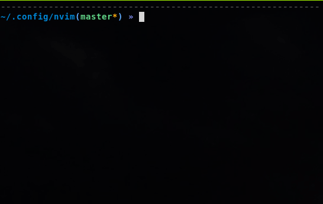

# haskell-format-import

[](https://travis-ci.com/chris-bacon/haskell-format-import)

This is a neovim plugin that formats your Haskell import statements, and **it is itself written in Haskell!**

How :fire: :fire: :fire: is that?!



## Features

- Sorts alphabetically
- Aligns on "qualified"
- Aligns on "as"
- Aligns on "()"

## Install

- You will need to install [nvim-hs](https://github.com/neovimhaskell/nvim-hs).
- Then 
```
cp src/HaskellFormatImport.hs ~/.config/nvim/nvim-hs/HaskellFormatImport.hs
cp src/HaskellFormatImport/Plugin.hs ~/.config/nvim/nvim-hs/HaskellFormatImport/Plugin.hs
```

Then add the following code to your `~/.config/nvim/nvim.hs` file,

```Haskell
..

import qualified HaskellFormatImport as HFI

..

main = do
  neovim defaultConfig
    { plugins = plugins defaultConfig ++ [ .., HFI.plugin ]
    }
```

## Usage

This plugin exposes the `HaskellFormatImport` command which you could map some keybinding to, or invoke directly.

## Tests

To run the tests you can run `stack test`
